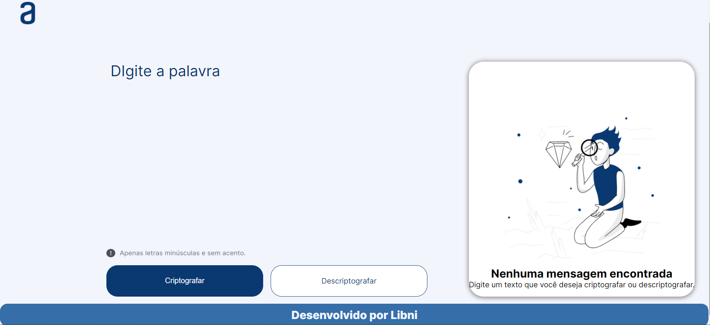

# Decodificador de textos 

Este projeto foi desenvolvido  desenvolvido utilizando HTML5,CSS3,JAVASCRIPT, é um decodificador de
textos , exercício proposto no curso ONE (Oracle Next Education) em parceria com a ALURA, afim de praticarmos os 
conhecimentos que aprendemos na primeira etapa do curso sobre programação HTML , CSS3  e JAVASCIPT. Aqui foi 
bastante exercitado os conceitos de responsividade e também o intenso trabalho com o javascript.

## Hospedagem 

Este projeto esta publicado aqui no site da Vercel, se quiser suma demosntraçaõ visite o site. 
https://decodificador-flax.vercel.app/

## 🛠️ Tecnologias utilizadas 

    
  
   
  

## 💻 Telas do sistema

   

## ✒️ Autor

Dev. Libni Evanio